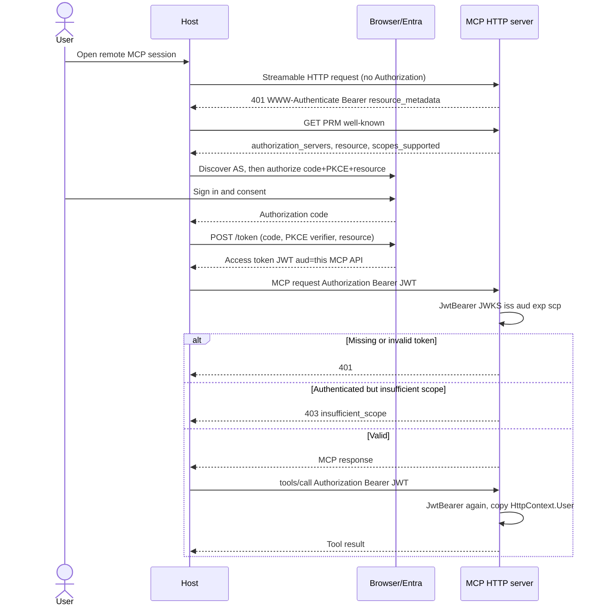
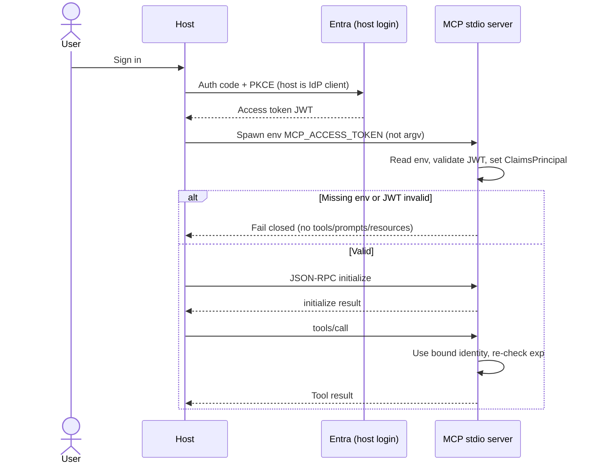
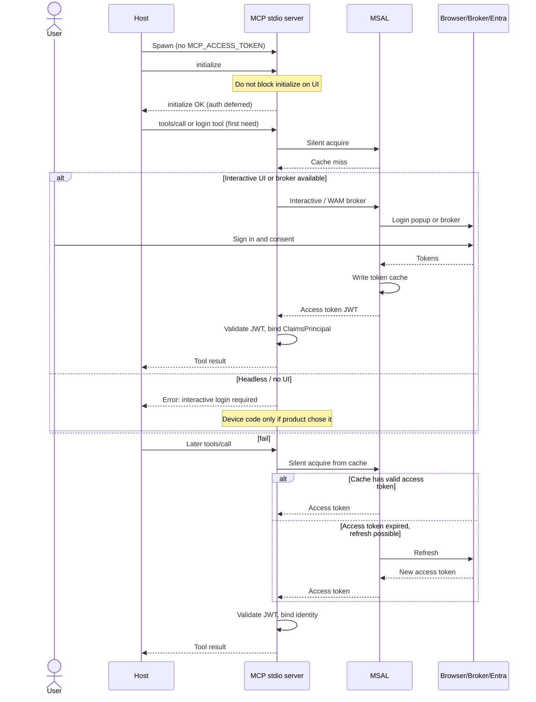
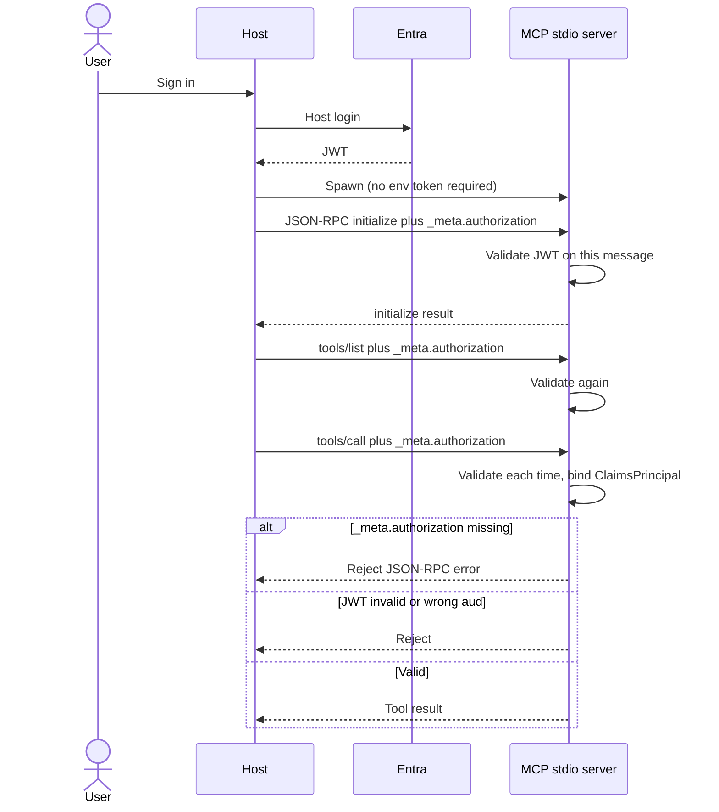
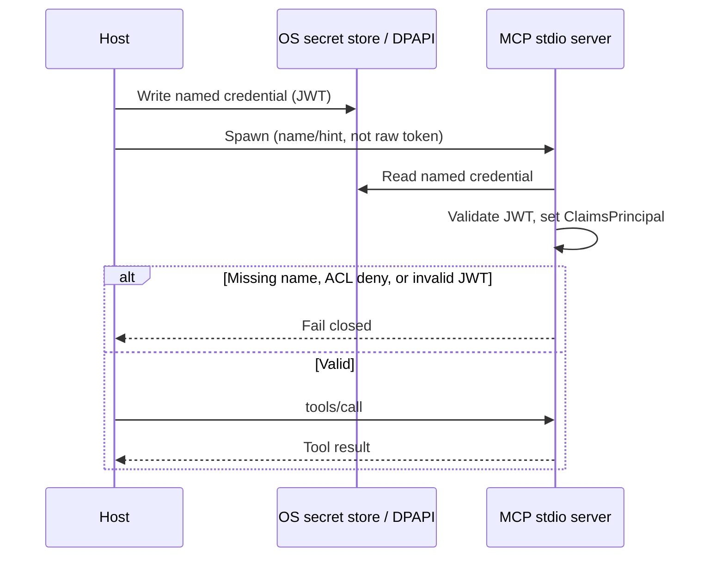
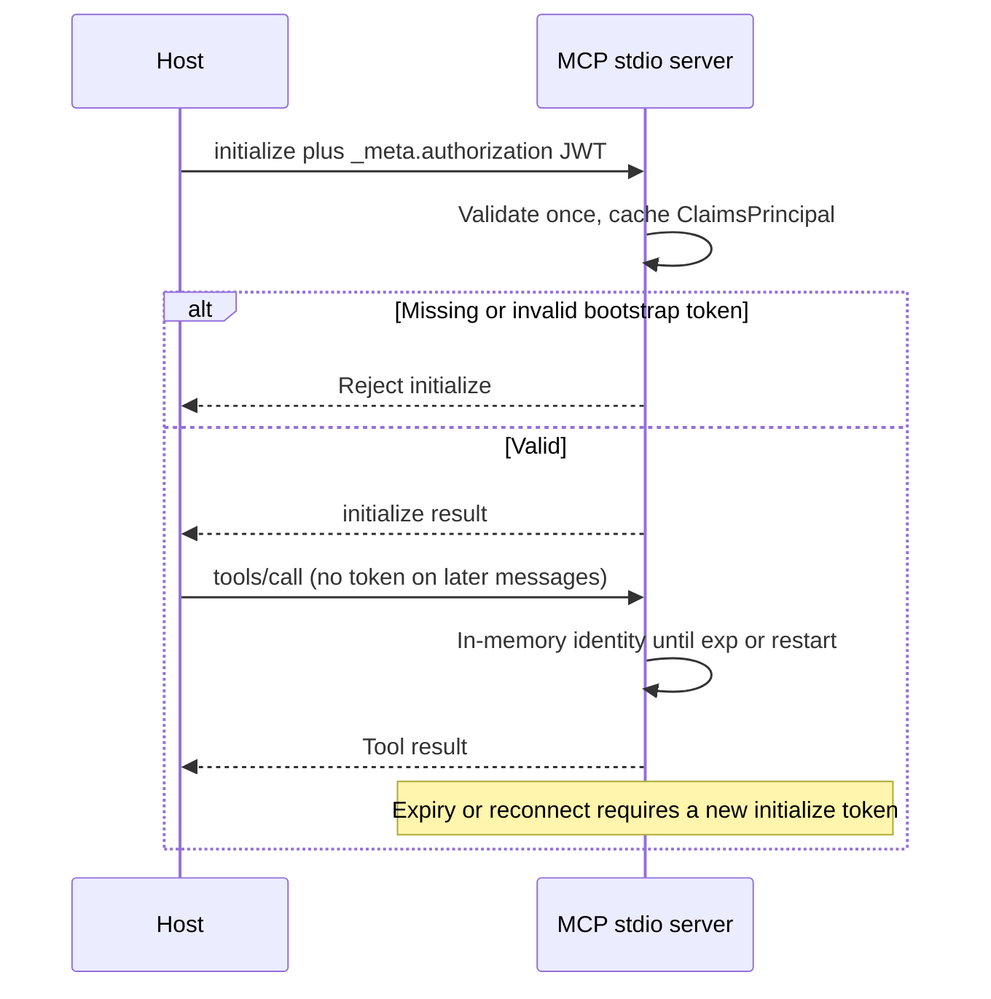
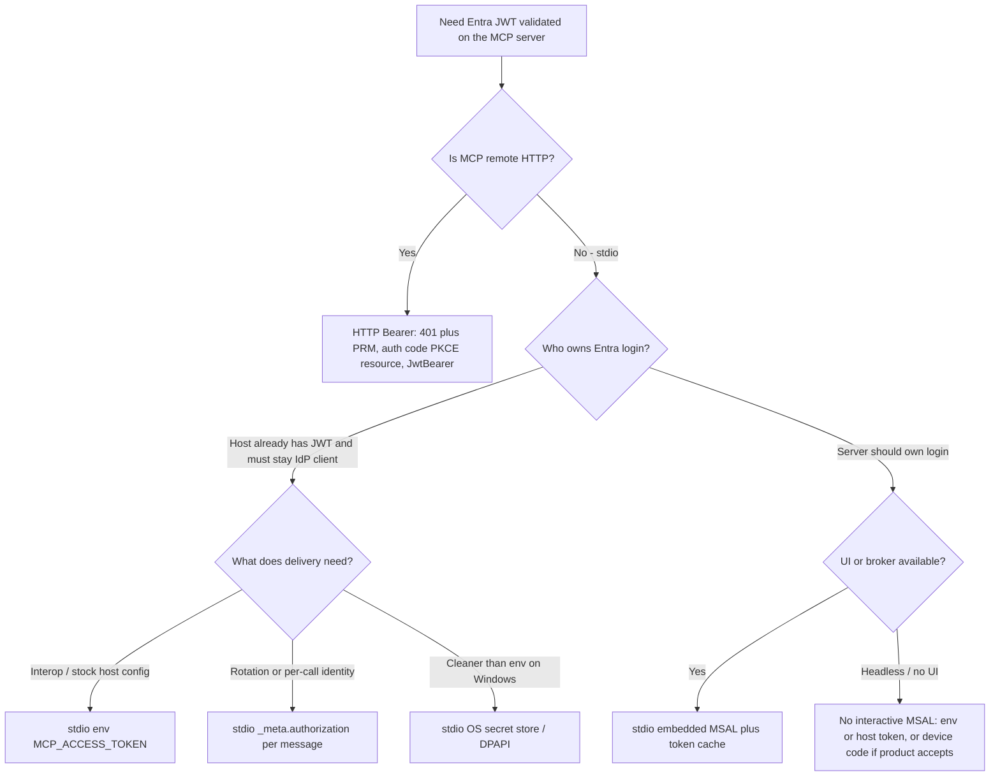

# ADR-001: MCP server OAuth with Microsoft Entra (HTTP + stdio)

- Status: Proposed
- Date: 2026-09-06
- Deciders: sheshi sheri / platform (MCP C# servers)
- Related: [research/2026-09-06-mcp-csharp-entra-auth-design.md](../2026-09-06-mcp-csharp-entra-auth-design.md)
- Spec baseline: MCP Authorization 2026-07-28 (official only; SEP-2809/3004 out of scope)
- Read next: [Flows](#flows-sequence-diagrams) · [Decision tree](#decision-tree-pick-one)

## Context

We build C# MCP servers over Streamable HTTP and stdio. The host/agent authenticates users via Microsoft Entra ID (OIDC) and obtains a JWT. Product requirement: both transports must validate that JWT (`iss`, JWKS/sig, `aud`, `exp`, scopes/roles), including stdio even on the same machine/process tree. We need an ADR for how OAuth/credentials work at design time.

The official 2026-07-28 authorization specification applies to HTTP-based transports. Implementations using stdio **SHOULD NOT** follow that HTTP OAuth flow and should retrieve credentials from the environment (or third-party libraries embedded in the server). There is no normative `_meta.authorization`. Retrieval is not validation. Validation is still required if the server will honor the token.

Failure mode this ADR is written to prevent: the HTTP server validates Entra JWTs while the stdio sibling trusts the parent process, or both servers accept any Entra token signed for a different API.

## Decision

### Shared (both transports)

1. The MCP server is an OAuth 2.1 **resource server** for token *validation* semantics even when delivery differs.
2. Always validate Entra JWTs before tools, prompts, or resources. Fail closed. Never log raw tokens. No token passthrough to upstream APIs.
3. Pin audience to this MCP API (Entra Application ID URI / agreed `aud`). Reject Graph or other APIs’ tokens.
4. Prefer short-lived access tokens; refresh stays with the host (or with MSAL inside the server if that option is chosen).

Shared validation (identical regardless of delivery channel):

- Signature against Entra JWKS
- `iss` (tenant / v2.0 issuer)
- `aud` bound to this MCP API only
- `exp` / `nbf` (plus bounded clock skew)
- Token type and authorization: delegated `scp` vs app-only `roles`
- Optional tenant pin (`tid`) when product requires it

Do not treat process launch, localhost binding, or “the host already signed in” as authentication.

### Streamable HTTP

Follow official MCP Authorization for HTTP:

- `Authorization: Bearer <jwt>` on every request (tokens **MUST NOT** appear in the query string)
- RFC 9728 Protected Resource Metadata (PRM), advertised via `WWW-Authenticate`
- RFC 8707 resource indicators on the client (`resource` = canonical MCP server URI)
- Streamable HTTP `Origin` validation (invalid present `Origin` → HTTP 403)
- Status mapping: 401 (missing/invalid token), 403 (authenticated but insufficient scope), 400 (malformed authorization request)
- Use ASP.NET Core JwtBearer / `Microsoft.Identity.Web` + `ModelContextProtocol.AspNetCore`

The C# MCP server is not the Entra authorization endpoint, not a consent screen, and not a token issuer. Do not re-implement `/authorize` or `/token` on the MCP host unless deliberately building a proxy AS.

### stdio (delivery)

Official MCP: stdio **SHOULD NOT** follow the HTTP OAuth flow; retrieve credentials from the environment (or third-party libraries embedded in the server). There is no normative `_meta.authorization`.

**Default delivery (recommended for interop):** environment variable at process spawn (e.g. `MCP_ACCESS_TOKEN`), not argv.

**Allowed alternatives** (document as org profiles if chosen):

- Embedded MSAL / Azure.Identity in the server (server acquires token itself)
- OS secret store (Windows Credential Manager / DPAPI)
- Custom `_meta.authorization` on JSON-RPC messages (per-call / rotation)
- Bootstrap token on `initialize` `_meta` then process-lifetime cache
- Side-channel IPC (named pipe / socket) — only if already required by platform
- Avoid: world-readable temp files; OS-user-only with no JWT unless product explicitly drops Entra binding

**Validation is identical** regardless of delivery channel. After the JWT validates, a stdio message filter must set `context.User` to a `ClaimsPrincipal` built from the token claims. Official C# identity propagation copies `HttpContext.User` on HTTP; on stdio, `ClaimsPrincipal` is **null** unless that filter runs. Do not inject a synthetic “stdio-user” principal without validating a token.

## Alternatives considered (stdio delivery matrix)

| # | Delivery | Official leaning | Pros | Cons |
| --- | --- | --- | --- | --- |
| 1 | Env var at spawn | Yes — retrieve credentials from the environment | Simple; works with stock hosts that can set `env` in MCP config; token stays off the JSON-RPC wire; one validate-at-startup (or first use) path; child process isolation if env is not inherited broadly | Process-lifetime token; refresh usually means restart; env can leak via `/proc`, crash dumps, process dumps, overly broad inheritance; easy to misconfigure (shared parent env, argv fallback, config files) |
| 2 | Embedded MSAL / Azure.Identity | Yes — official tutorial “third-party libraries” | Server owns login/refresh; no host JWT handoff; short-lived tokens + refresh without respawn; matches Azure.Identity patterns already used in C# | Not “host hands JWT”; interactive/device-code or managed-identity setup lives in the server; host and server identities can diverge; extra dependencies and first-run UX |
| 3 | OS secret store / DPAPI | Custom (naming convention) | Cleaner than a raw env var in some Windows deployments; secret not sitting in the process environment table; OS ACLs / DPAPI bind to user or machine | Naming convention is custom; host and server must agree on credential name; not portable to every host; still typically process-lifetime unless polled |
| 4 | `_meta.authorization` per message | Custom — no normative `_meta.authorization` | Rotation and step-up without restart; per-call identity; fits “validate every call” like HTTP Bearer; host can swap user/tenant tokens if one stdio process is multiplexed | Non-interop with stock hosts; token rides in message metadata (protocol logs, OpenTelemetry, debug traces); every call path must attach it; invented schema to version; easy to forget on notifications / `tools/list` |
| 5 | Initialize bootstrap `_meta` then cache | Custom hybrid | One attachment at `initialize`; simpler than per-message `_meta`; still allows host-owned login | Still custom / non-interop; token lifetime ≈ process lifetime after bootstrap; initialize-only `_meta` is easy to miss on reconnect; cache must not be logged |
| 6 | Side-channel IPC (named pipe / socket) | Custom — only if platform already requires it | Powerful: rotation, back-channel revoke, no token on JSON-RPC or env; can reuse an existing platform IPC | Complexity (auth of the side channel itself, lifecycle, Windows vs Unix); fragments clients; overkill unless the platform already has the pipe/socket |
| 7 | Restricted file drop | Generally discouraged | Simple to reason about for some launchers; can be ACL’d to the OS user | TOCTOU and leftover files; world-readable temp files are unacceptable; easy to echo paths into logs; not official |
| 8 | OS identity only (no JWT) | Different trust model | No token handling; process identity / named-pipe ACL is the whole story | Only if product explicitly waives Entra audience binding; no `aud`/`iss`/`scp` check; “local process = trusted” is the failure mode this ADR rejects |

### Practical pick table

| Goal | Prefer |
| --- | --- |
| Interop / default host config | Env |
| Server owns login / refresh | MSAL inside server |
| Host owns login; per-call / rotate | `_meta.authorization` |
| Host owns login; cleaner than env | Credential Manager / DPAPI |

v1 recommendation: **env var at spawn** (`MCP_ACCESS_TOKEN`), with the same JWT validation as HTTP. Document any other row as an org profile, not as protocol-mandated MCP.

## Flows (sequence diagrams)

These diagrams are the option analysis a reader would otherwise have to reconstruct from chat. **Validation is identical in every flow** (Entra JWKS signature, `iss`, `aud` pinned to this MCP API, `exp`/`nbf`, `scp` vs `roles`, optional `tid`). Only *delivery* and *who is the Entra client* change.

How to read them:

- The MCP server is always a **resource server**. It never issues tokens.
- HTTP follows official MCP Authorization (2026-07-28): 401 + PRM, host does auth code + PKCE + `resource`, then `Authorization: Bearer`.
- stdio **SHOULD NOT** follow that HTTP OAuth dance. The host (or an embedded library) retrieves a credential; the server still validates the JWT and binds `ClaimsPrincipal`.
- Side-channel IPC, world-readable files, and “OS user only / no JWT” are in the alternatives table and are **not** drawn here.

Shared C# bind step after a JWT validates: message filter sets `context.User` from token claims. On stdio this is required; `ClaimsPrincipal` is otherwise null.

### 1. HTTP — Host Entra + Bearer

Normative MCP HTTP path. Host is the Entra public client. Server publishes RFC 9728 PRM and validates with ASP.NET Core JwtBearer / `Microsoft.Identity.Web`.

**When to use / when not / failure modes**

- Use when the MCP server is reached over Streamable HTTP (local bind or remote). This is the only official OAuth path.
- Do not invent a parallel HTTP header or query-string token. Do not put the JWT in the URL.
- Do not implement `/authorize` or `/token` on the MCP host unless you are deliberately a proxy AS (confused-deputy controls then apply).
- Failures: missing PRM / wrong `resource` → host cannot obtain a token with the right `aud`; Graph or other-API `aud` → 401; invalid `Origin` → 403 independent of JWT; clock skew / expired `exp` → 401; insufficient `scp` → 403.
- Entra friction: PRM `resource` is the canonical MCP URI; Entra `aud` is usually the Application ID URI. Align them or document the split. Never silently accept both plus Graph.

### 2. stdio — Env var handoff

Official-leaning default. Host stays the Entra client. Token is delivered at spawn in `MCP_ACCESS_TOKEN` (not argv). Server validates once (startup or first use) and binds identity for the process.

**When to use / when not / failure modes**

- Use for interop and stock host MCP config (`env` in the server launch block). v1 recommendation.
- Do not use when the token must rotate or step-up without respawn, or when one stdio process must multiplex users.
- Do not put the JWT on `argv`, in a world-readable file, or in a shared parent environment that children inherit broadly.
- Failures: empty/malformed env → refuse; expired token mid-session → refuse until host restarts the process with a fresh JWT; `/proc`, crash dumps, and process dumps leak the env; logging `Environment.GetEnvironmentVariable` or echoing config dumps the token.
- Validation still runs. “We spawned you, therefore you are me” is not authentication.

### 3. stdio — Embedded MSAL interactive + token cache

Official-leaning “third-party libraries” path. Server is the Entra client. Host launches with **no** token. Prefer **first-need** or an explicit **login tool**; do **not** block `initialize` forever waiting on a popup.

**When to use / when not / failure modes**

- Use when the server should own login and refresh (desktop IDE with UI, WAM/broker, or an explicit login tool). Matches Azure.Identity / MSAL patterns already used in C#.
- Do not use as the silent default on headless CI, SSH, or service hosts. Interactive MSAL will hang or fail; use env/host token or (if product accepts) device code.
- Do not block `initialize` on the first interactive prompt. Hosts time out; prefer deferred auth on first privileged call or a `login` tool the host can invoke when a human is present.
- Failures: cache ACL too open → token theft; cache miss after restart with no UI → hard fail (do not retry-loop); host identity and server identity diverge if both sign in; refresh-token persistence needs DPAPI/broker protection, not a plaintext file next to the binary.
- Still validate the access token the same way. MSAL acquisition is delivery, not a substitute for `aud`/`iss` checks.

### 4. stdio — `_meta.authorization` per message

Custom org profile (not official MCP). Host stays the Entra client and holds the JWT. Every JSON-RPC message carries `_meta.authorization`. Server validates **each** time and rejects if the field is missing.

**When to use / when not / failure modes**

- Use when you control host **and** server and need rotation, step-up, or per-call / multiplexed identity without respawn.
- Do not use with stock hosts. There is no normative `_meta.authorization`; third-party clients will not send it.
- Do not attach the token only on `tools/call`. `tools/list`, prompts, resources, and notifications that authorize work must carry it or be rejected.
- Failures: forgotten `_meta` on one method → fail closed (good) or accidental anonymous path (bad if the filter is method-scoped); protocol logs, OpenTelemetry attributes, and debug traces capture the JWT; invented schema drift (`string` vs object, `Bearer ` prefix) between host and server.
- Version the field yourself. Still never log the raw token.

### 5. stdio — OS secret store / DPAPI

Shorter custom profile. Host stores the JWT under an agreed name; server reads that credential, validates, binds. Cleaner than a raw env var on Windows.

**When to use / when not / failure modes**

- Use on Windows when the host owns login and you want the secret out of the process environment table (Credential Manager / DPAPI, user- or machine-bound).
- Do not use as a portable interop default. macOS Keychain / libsecret variants need their own naming contract; stock hosts will not know the name.
- Still typically process-lifetime unless the server re-reads on a schedule. Refresh usually means the host overwrites the credential and the server re-reads, or the process restarts.
- Failures: host and server disagree on credential name; ACL too broad (other local processes read it); leftover credentials after logout; treating DPAPI unwrap as validation (still run JWKS/`aud`/`exp`).
- Do not fall back to a plaintext file if the store is unavailable.

### 6. stdio — initialize bootstrap `_meta` then cache

Shorter custom hybrid. Token is attached once on `initialize`. Server validates, caches the identity in memory, and uses it for later calls until expiry or process restart.

**When to use / when not / failure modes**

- Use when you control host and server, want host-owned login, and want one attachment instead of per-message `_meta`.
- Do not use when tokens must rotate mid-process without a new `initialize`, or when a reconnect can skip `_meta` (easy to miss).
- Not interop. Same invented-schema cost as per-message `_meta`, with a longer cached lifetime.
- Failures: cached principal used after `exp` if the filter does not re-check lifetime; reconnect without `_meta` silently reuses a dead cache (must not); initialize payload logged → token leak; process dump contains the in-memory JWT.
- Cache must not be written to disk or logs. On expiry, fail closed until the host re-bootstraps.

## Decision tree (pick one)

Use this to lock a v1 profile. Do not mix two deliveries in the same server process unless you have an explicit migration story.

Reading the tree:

- Remote HTTP is not a choice among stdio profiles. It is the official Bearer path.
- If the host is already the Entra client, keep it that way: env (interop), `_meta` (rotation), or DPAPI (Windows secret store). Bootstrap-`initialize`-then-cache is a hybrid of `_meta` if you want one attachment only.
- If the server should own login, embed MSAL. That requires a human or broker. Headless CI/SSH must not sit on an interactive prompt; take a host-issued token (env/DPAPI/`_meta`) or an explicit device-code profile.
- v1 default when the host already has a JWT: **env var at spawn**.

## Consequences

### Positive

- Clear split: HTTP = normative MCP OAuth; stdio = delivery profile + same validation
- Avoids false sense of security from “local process = trusted”
- Gives product a menu without pretending custom channels are protocol-mandated
- Flows + decision tree are self-contained: an implementer can pick a delivery and code the bind/`ClaimsPrincipal` path without another design thread

### Negative / risks

- Env default needs careful inheritance and no argv/logging
- `_meta` or file/IPC profiles fragment client interoperability
- Interactive MSAL will stall hosts if `initialize` waits on a popup; headless must fail fast instead
- Entra `resource` URI vs Application ID URI `aud` friction remains a separate design decision (see [research note — Entra mapping](../2026-09-06-mcp-csharp-entra-auth-design.md#entra-mapping)): RFC 8707 wants the MCP HTTP URI in `resource` / `aud`; Entra `aud` is usually the Application ID URI (`api://<app-id>`) or the application (client) ID GUID. Either set the Entra Application ID URI **equal** to the MCP canonical resource URI, or document that the server validates Entra `aud` while PRM `resource` remains the HTTP URI. Do not silently accept both plus Graph (`00000003-0000-0000-c000-000000000000`).

### Follow-ups

- Lock v1 with the [decision tree](#decision-tree-pick-one) (still recommend env `MCP_ACCESS_TOKEN`) and document the C# `ClaimsPrincipal` filter
- If the MSAL profile is chosen: login tool or first-need auth; never block `initialize` indefinitely; headless → device code or host token
- If `_meta.authorization` is chosen: publish the org schema and require it on every JSON-RPC method, not only `tools/call`
- Align Entra App ID URI with MCP canonical resource URI where possible
- Private audit schema (SEP-3004 not Final)

## References

- [MCP Authorization (2026-07-28)](https://modelcontextprotocol.io/specification/2026-07-28/basic/authorization)
- [MCP authorization tutorial (2026-07-28)](https://modelcontextprotocol.io/docs/2026-07-28/tutorials/security/authorization)
- [Authorization security considerations](https://modelcontextprotocol.io/specification/2026-07-28/basic/authorization/security-considerations)
- [Security best practices](https://modelcontextprotocol.io/specification/2026-07-28/basic/security_best_practices)
- [Streamable HTTP](https://modelcontextprotocol.io/specification/2026-07-28/basic/transports/streamable-http)
- [stdio](https://modelcontextprotocol.io/specification/2026-07-28/basic/transports/stdio)
- [RFC 9728 — OAuth 2.0 Protected Resource Metadata](https://www.rfc-editor.org/rfc/rfc9728)
- [RFC 8707 — Resource Indicators for OAuth 2.0](https://www.rfc-editor.org/rfc/rfc8707)
- [research/2026-09-06-mcp-csharp-entra-auth-design.md](../2026-09-06-mcp-csharp-entra-auth-design.md)
- [C# SDK identity and role propagation](https://github.com/modelcontextprotocol/csharp-sdk/blob/main/docs/concepts/identity/identity.md)
- [ProtectedMcpServer sample](https://github.com/modelcontextprotocol/csharp-sdk/tree/main/samples/ProtectedMcpServer)
